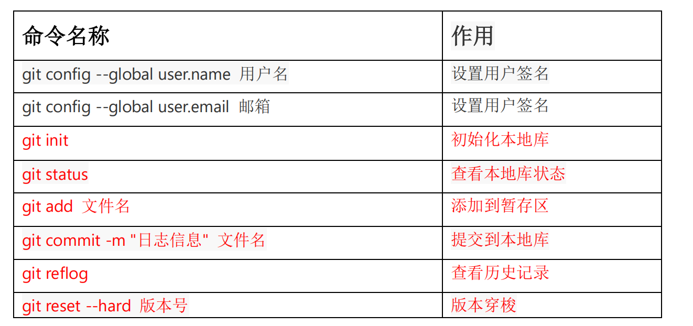

# Git

## 	1.常用命令



（第一次使用要设置用户签名 才能提交代码 配置文件在C:\Users\ASUS\ .gitconfig）

```bash
git config --global user.name yql
git config --global user.email 1014796661@qq.com
```


### 1.1初始化

```bash
git init 
```


生成.git


### 1.2查看本地库状态

```bash
git status
```

#### 1.2.1首次查看（工作区没有文件）


#### 1.2.2添加文件后（检测到未追踪的文件）


### 1.3添加到暂存区

```bash
git add 文件名
```


查看状态（检测到暂存区有新文件）


### 1.4提交本地库

```bash
git commit -m "信息" 文件名
```


​									**<u>(33973ac) 是版本号</u>**

查看状态（没有文件需要提交）


### 1.5修改文件的状态

查看状态（工作区有更改）


提交暂存区后查看状态


### 1.6历史版本

```bash
git reflog #查看版本信息
git log #查看详细信息
```


### 1.7 版本穿梭

```bash
git reset --hard 版本号
```


## 2.Git分支操作

### 2.1常用命令


### 2.2查看分支

```bash
git branch -v 
```


### 2.3创建分支

```bash
git branch 分支名
```


查看分支


### 2.4切换分支

```bash
git checkout 分支名
```


### 2.5合并分支

```bash
git merge 要合并的分支名
```


### 2.6合并有冲突


手动修改？？？？

提交本地库不要带文件名


# GitHUb

## 1.常用命令


### 1.1 起别名

```bash
git remote add 别名 远程地址
```


### 1.2查看当前所有别名

```bash
git remote -v
```


### 1.3推送远程仓库

```bash
git push 别名 分支
```


### 1.4拉取本地库

``` bash
git pull 别名 分支
```


1.5克隆本地库

```bash
git clone 远程库链接
```


## 2.添加合作者


## 3.跨团队协作


## 4.SSH免密登录

### 运行命令生成.ssh 秘钥目录

```bash
ssh-keygen -t rsa -C 邮箱号
```


### 生成


### 查看id_rsa.pub 复制


### 然后在GitHub输入


### 成功效果


# IDEA集成git

## 1.配置GIt忽略文件

### 	1.1 idea特定文件


### 	1.2 maven工程的target目录


​	这些与项目功能运行无关，不参与服务器上部署

### 	1.3 创建忽略规则文件 git.ignore (前缀名可以随意)

​	 建议放在用户名文件夹下


#### 		git.ignore 模板		

```bash
# Compiled class file
*.class

# Log file
*.log

# BlueJ files
*.ctxt

# Mobile Tools for Java (J2ME)
.mtj.tmp/

# Package Files #
*.jar
*.war
*.nar
*.ear
*.zip
*.tar.gz
*.rar

# virtual machine crash logs, see 
http://www.java.com/en/download/help/error_hotspot.xml
hs_err_pid*

.classpath
.project
.settings
target
.idea
*.iml
```

#### 在"C:\Users\ASUS\.gitconfig" 下输入引用忽略配置文件 （注意使用的是/）

```bash
[user]
	name = yql
	email = 1014796661@qq.com
[core]
	excludesfile = C:/Users/ASUS/git.ignore
	#注意：这里要使用“正斜线（/）”，不要使用“反斜线（\）”
```


# idea 集成gitee

## 	1.如果推送不了

​	

但 GitHub可以 可能是在gitee设置了不公开邮箱地址，同时禁止了命令行推送暴露个人邮箱

解决方法：需要设置gitte上找到允许推送的邮箱地址，然后设置在本地的git环境变量中。

1.点开设置

2.点开多邮箱管理

3.取消勾选“禁止命令行推送暴露个人邮箱”，此项默认是勾选状态


修改后成功效果


# github复制迁移到gitee

​	


